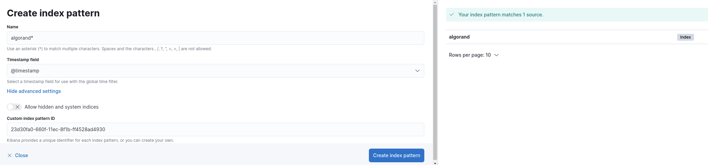

# algorand-to-elk

# Starting the ELK Stack using the Docker-Compose file
1. Intall [Docker Compose](https://docs.docker.com/compose/install/)
2. While in this repository's folder, run `docker-compose up`
3. To stop the container while keeping the contents for next time the container runs, run `docker-compose stop`
    - To wipe the contents of the container and delete it, run `docker-compose down`

# Configuring Logstash in the ELK container
1. Place `algo-logs.conf` in the `/etc/logstash/conf.d/` directory in the ELK container.
	- To get a bash shell in the ELK container, run `docker exec -it <container name> bash`
	- Ensure no other configurations in the `/etc/logstash/conf.d` directory are using the same port as `algo-logs.conf`.

# Configuring Filebeat on the Algorand node server
1. Install [Filebeat](https://www.elastic.co/guide/en/beats/filebeat/current/filebeat-installation-configuration.html) on the server running the Algorand node.
2. Place `filebeat.yml` in the `/etc/filebeat/` directory on the Algorand node.
3. Create a service for Filebeat to run on boot for the server.

# Configuring the Kibana instance
1. Once the service is created and running, navigate to the URL of Kibana on the ELK Container.
	- If running locally on the Algorand node, it is `localhost:5601`
2. Once the Elastic page has loaded, create an index pattern.
	- Search `index pattern` in the Elastic search bar at the top center of the page.
	- Name the index pattern as `algorand*`.
	- Use the custom index pattern ID of `23d30fa0-660f-11ec-8f1b-ff4528ad4930` under advanced settings.
	- 
3. Import the dashboard (`dashboard-to-import.json`).
